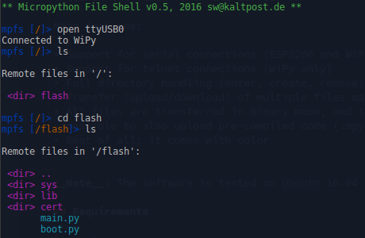

# mpfshell

2016-06-21, sw@kaltpost.de. Forkbase  
2017-02-17, latest version. Forked by and modified for LoPy use by github.com/PMunch

A simple shell based file explorer for ESP8266, WiPy, and LoPy [Micropython](https://github.com/micropython/micropython) based devices.

The shell is a helper for up/downloading files to the ESP8266 (over serial line and Websockets) and WiPy/LoPy (serial line and telnet). It basically offers commands to list and upload/download files on the flash FS of the device.

- [mpfshell](#mpfshell)
  * [Main features:](#main-features-)
  * [Requirements](#requirements)
  * [Installing](#installing)
  * [Known Issues](#known-issues)
  * [General](#general)
    + [TAB Completion](#tab-completion)
    + [File/Directory Names](#file-directory-names)
    + [Local vs. Remote](#local-vs-remote)
  * [Shell Usage](#shell-usage)
    + [Help](#help)
    + [Prefixes](#prefixes)
    + [Running and connecting](#running-and-connecting)
    + [REPL](#repl)
    + [Scripting](#scripting)
    + [Sample use](#sample-use)
  * [Running the Shell in a Virtual Environment](#running-the-shell-in-a-virtual-environment)
  * [Python 2 support](#python-2-support)

<small><i><a href='http://ecotrust-canada.github.io/markdown-toc/'>Table of contents generated with markdown-toc</a></i></small>

## Main features:

* Support for serial connections (ESP8266, WiPi and LoPy)
* Support for websockets (via WebREPL) connections (ESP8266 only)
* Support for telnet connections (WiPy and LoPy only)
* Full directory handling (enter, create, remove)
* Transfer (upload/download) of multiple files matching a reg.-exp.
* Transfer (upload/download) of moltiple files and folders recursively
* All files are transferred in python safe mode, and thus it should be possible to also upload pre-compiled code (.mpy) too. __Note__: Using .mpy files require firmware support from MicroPython. LoPy and probably WiPy official builds does not have this.
* Integrated REPL (supporting a workflow like: upload changed files, enter REPL, test, exit REPL, upload ...)
* Fully scriptable
* Tab-completion
* Command history
* Best of all: it comes with color

__Note__: This version is tested on Manjaro and Windows but only supports Python 3. Some setups are known to not work with tab-completion

## Requirements

General:

* ESP8266 or WiPy/LoPy board running latest [Micropython](https://github.com/micropython/micropython)
* For the ESP8266 firware build from the repository, please not, that WebREPL is not started by default. For more information see the [quickstart](http://micropython.org/resources/docs/en/latest/esp8266/esp8266/quickref.html#webrepl-web-browser-interactive-prompt).
* For the WiPy/LoPy, please note, that you need to enable REPL on UART if you intend to connect
  via serial line to the WiPy/LoPy (see [here](http://micropython.org/resources/docs/en/latest/wipy/wipy/tutorial/repl.html))

For the shell:

* Python >= 3.4
* The PySerial library >= 2.7 (sudo pip3 install pyserial)
* The colorama library >= 0.3.6 (sudo pip3 install colorama)
* The websocket-client library >= 0.35.0 (sudo pip3 install websocket-client)

__IMPORTANT__: PySerial versions before 2.7 really don't work!!! It is highly recommended to use PySerial version 3.x and Python3.
 
__Note__: The tools only works if the REPL is accessible on the device!

## Installing

To install this tool for __Python 3__, execute the following:

	sudo pip3 install pyserial
    sudo pip3 install colorama
    sudo pip3 install websocket_client
    sudo python3 setup.py install

## Known Issues

* Some setups don't have tab-completion, working on figuring out why
* For PySerial 2.6 the REPL is deactivated since Miniterm which comes with 2.6 seams broken.

## General

### TAB Completion

The shell supports TAB completion for commands and file names. So it totally is worth it pressing TAB-TAB every now and then. This feature is known to not work for all setups, why is still unclear.

### File/Directory Names

File-names including whitespaces are supported, but such names need to be enclosed in quotes. E.g. accessing a file named "with white space.txt" needs to quoted:

    get "with white space.txt"
    put "with white space.txt" without-white-space.txt
    put without-white-space.txt "with white space.txt"
    
The following characters are accepted for file and directory names:

    A-Za-z0-9 _%#~@/\$!\*\.\+\-

The use of . and .. is currently not supported for file names in get and put commands.

### Local vs. Remote

In mpfshell terminology the machine running mpfshell is local and the device connected is remote. This matters when you want to use put and get commands in order to get the arguments right. When using the shell many of the commands can also be prefaced with `l` in order do use a local command. Examples of this is `lls` and `lcd` which lists and changes directory respectively on the machine running mpfshell.

## Shell Usage

### Help

If you are stuck you can use the `help` command which shows you all available commands and can be used in conjunction with commands like `help cd` to see what the do.

    mpfs> help
    mpfs> help <command>

### Prefixes

Some commands come in multiple version. Here are some common prefixes

* `m` are regex matching commands. They take a regex and applies their command to the matching elements.
* `l` are local commands. These are commands that run on the host machine.
* `r` are recursive commands. These works on all files and directories recursively.
    
### Running and connecting

__Note:__ Since version 0.7.1, the shell offers caching for file and directory names. It is now enabled by default. To disable caching, add the `--nocache` flag on the command line. In some cases the cash is not properly invalidated and old data could be present. For debugging purposes please use `--nocache`.

Start the shell with:

    mpfshell

At the shell prompt, first connect to the device. E.g. to connect via serial line:

    mpfs> open ttyUSB0

__Note__: On Linux machines ttyUSBX might not be owned by the user. Either run mpfshell as root (discouraged), or add your user to the appropriate group. A good way to do this is to run `ls -l /dev | grep ttyUSB` and see which group it belongs do (typically dialout or uucp) and then add it according to your distribution documentation.
    
Or connect via websocket (ESP8266 only):

    mpfs> open ws:192.168.1.1,python
    
Or connect vial telnet (WiPy only):

    mpfs> open tn:192.168.1.1,micro,python
    
__Note__: Login and password are optional. If left out, they will be asked for.

### REPL
	
Since this is MicroPython there is also a REPL available. To access the REPL simply use:

    repl
    
To exit REPL and return to the file shell use `Ctrl+Alt+]`. To soft reboot the device while in the REPL use `Ctrl+D`, this will run the main.py file and is a good way to test code.

### Scripting

In order to be easier to use with your existing editor mpfshell is also scriptable. This means that you don't have to enter the interactive mode and manually type out commands. Automated build systems or simple editor shortcuts can benefit greatly from this.

E.g. to connect to the device, and then enter the shell:

    mpfshell -c "open ttyUSB0"
    
Or to copy the file "boot.py" to the device, and don't enter the shell at all:

    mpfshell -n -c "open ttyUSB0; put boot.py"

It is also possible to put multiple shell commands in a file, and then execute
them from that file.
 
E.g. creating a file called "myscript.mpf":

    open ttyUSB0 
    put boot.py
    put main.py
    ls
    
And execute it with:

    mpfshell -s myscript.mpf 

### Sample use

Here are some examples on what you can do once connected to a device with mpfshell.

You can list the files in the current directory with:

    mpfs> ls

To upload e.g. the local file "boot.py" to the device use:

    mpfs> put boot.py

If you like to use a different filename on the device, you could use this:

    mpfs> put boot.py main.py

Or to upload all files that match a regular expression from the 
current local directory to the current remote directory:

    mpfs> mput .*\.py

And to download e.g. the file "boot.py" from the device use:

    mpfs> get boot.py
    
Using a different local file name:

    mpfs> get boot.py my_boot.py

Or to download all files that match a regular expression from the 
current remote directory to the current local directory:

    mpfs> mget .*\.py

To remove a file (or directory) on the device use:

    mpfs> rm boot.py

Or remove all remote files that match a regular expression:

    mpfs> mrm test.*\.py

To create a new remote directory:

    mpfs> md test

To navigate remote directories:

    mpfs> cd test
    mpfs> cd ..
    mpfs> cd /some/full/path
    
See which is the current remote directory:

    mpfs> pwd

Remove a remote file or directory:

    mpfs> rm test
    
__Note__: Directories to delete needs to be empty!

Remove a remote directory recursively:

	mpfs> rmr test

To navigate on the local filesystem, use:

    lls, lcd lpwd

## Running the Shell in a Virtual Environment

Somtimes it is the easiest way to setup a virtual environment to satisfy the
requirements. E.g. on Debian Jessi (which still has PySerial 2.6), this could be
done like so (assuming you are within the `mpfshell` base directory:

Install support for virtual environments:

    sudo apt-get install python3-venv

Create a new virtual environment:

    pyvenv venv
    
Activate it (so the following `pip3 install` commands goes to the new virtuel environment):

    source venv/bin/activate
    
Now install the dependencies to the virtual environment:

    pip3 install pyserial
    pip3 install colorama
    pip3 install websocket_client
    
Now run the shell with the following command:

    python3 -m mp.mpfshell
    
__Note__: The environment always need to be activated with the above `source` command.

## Python 2 support

The original version of this script included support for Python2. This support was unknowingly broken at some point during the rewrite. However since Python3 came out in 2008, almost 10 years ago, we've decided to not strive to be Python2 compatible and rather focus on creating new features and improving the software. If you still need Python2 support for something and would like to contribute patches to make it compatible please feel free to do so but officially Python2 support is dead.